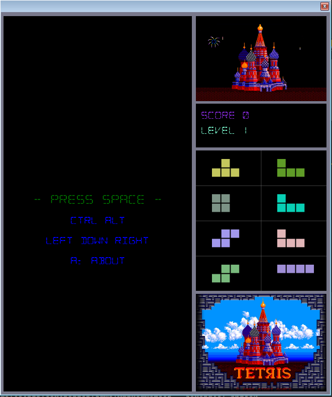

Tetris FX
=========
An tetris clone written in JavaFx.
The number of columns and rows does not correspond to the original Tetris.

#### Requirements

* Java 8 JDK or higher
* Maven 3

#### Run Application

```console
java -jar tetris-1.0-SNAPSHOT-fat.jar
```



***

Rest Service
======
You can also control the game over the rest api under localhost:3000/api

| Request type   |      Path       | Body/Param |Description |
| ------------- | ---------------- | ---------- | ---------- |
| GET           |  `/field`        | None       | Get current field model |
| GET           |  `/gamestate`    | None       | Access the state of the game e.g started or not |
| GET           |  `/speed`        | None       | Get the current game speed |
| GET           |  `/level`        | None       | Get the current level |
| GET           |  `/finishedrows` | None       | Get processed rows    |
| POST          |  `/turn`         | see (1)    | control the tetris blocks |

---
(1)
```javascript
{
    cmd : 1
}
```

Following commands are available

| cmd |  Description |
| --- | ------------ |
| 1   |  Move left   |
| 2   |  Move right  |
| 3   |  Move down   |
| 4   |  Rotate left |
| 5   |  Rotate right|
| 6   |  Start game  |
| 7   |  Pause game  |
| 8   |  Stop game   |
---

License
=======

Tetris and its logo is a trademark of The Tetris Company, LLC

[MIT](http://en.wikipedia.org/wiki/MIT_License) license © Lam
